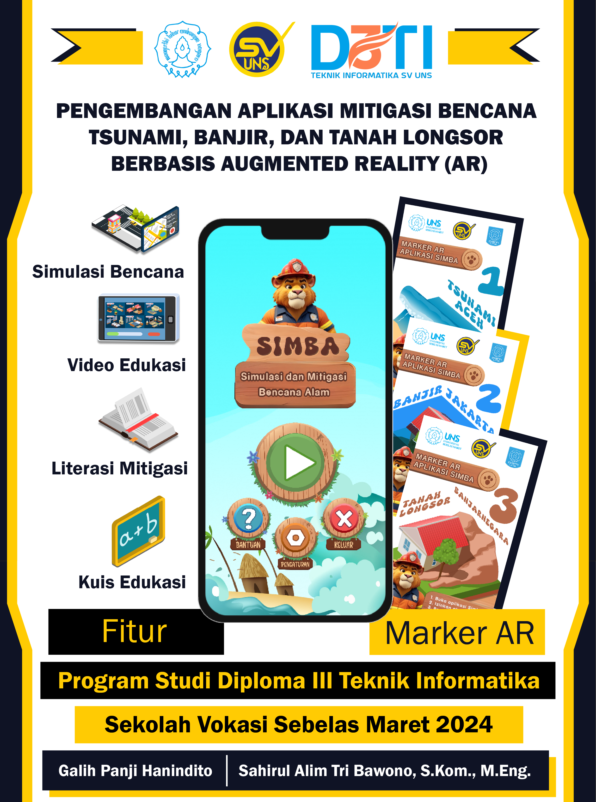

<!-- Improved compatibility of back to top link: See: https://github.com/othneildrew/Best-README-Template/pull/73 -->

<!-- PROJECT LOGO -->
 

  

  <h3 align="center">SIMBA AR</h3>

  

    Aplikasi Edukasi Mitigasi Bencana Augmented Reality
     
     
  

<!-- ABOUT THE PROJECT -->
## Deskripsi Produk

 
 
 

SIMBA AR yang merupakan kependekan dari Simulasi dan Mitigasi Bencana Alam Augmented Reality adalah sebuah aplikasi edukasi mitigasi bencana alam tsunami, banjir, dan tanah longsor untuk perangkat dengan sistem operasi Android.

SIMBA AR juga membahas penyebab bencana, persiapan menghadapi atau sebelum bencana, SOP saat bencana melanda, dan hal yang dapat dilakukan setelah bencana yang ditampilkan melalui konten-konten dalam aplikasi contohnya adalah simulasi kejadian bencana menggunakan teknologi augmented reality, literasi edukasi, video edukasi, serta kuis edukasi yang terhubung dengan situs CMS untuk memperbarui pertanyaan kuis edukasi.

(<a href="#readme-top">back to top</a>)

<!-- FEATURES -->

## Fitur
* <b>Materi Bencana =></b> Tsunami, Banjir, dan Tanah Longsor.
* <b>Literasi Mitigasi Bencana</b>
* <b>Video Edukasi</b>
* <b>Kuis Mini Games</b>

(<a href="#readme-top">back to top</a>)

<!-- FEATURES -->
## Informasi Pengguna

* <b>Pengguna =></b> aplikasi ini untuk digunakan pada rentang umur 12-45 tahun, serta memiliki telepon genggam dengan sistem operasi Android.

* <b>Keterampilan yang diperlukan =></b> Pengetahuan dasar tentang telepon genggam dan teknologi Augmented Reality.

(<a href="#readme-top">back to top</a>)

<!-- CONTACT -->
## Kontak

Nama: Galih Panji Hanindito

NIM: V3421048

Email: [galihpanji058@student.uns.ac.id](mailto:galihpanji058@student.uns.ac.id)

Github: [https://github.com/SPENCER058/Tugas-Akhir-SIMBA](https://github.com/SPENCER058/Tugas-Akhir-SIMBA)

(<a href="#readme-top">back to top</a>)

<!-- MARKDOWN LINKS & IMAGES -->
<!-- https://www.markdownguide.org/basic-syntax/#reference-style-links -->
[product-screenshot]: Readme/poster.png
